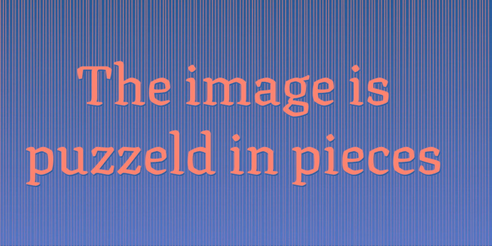
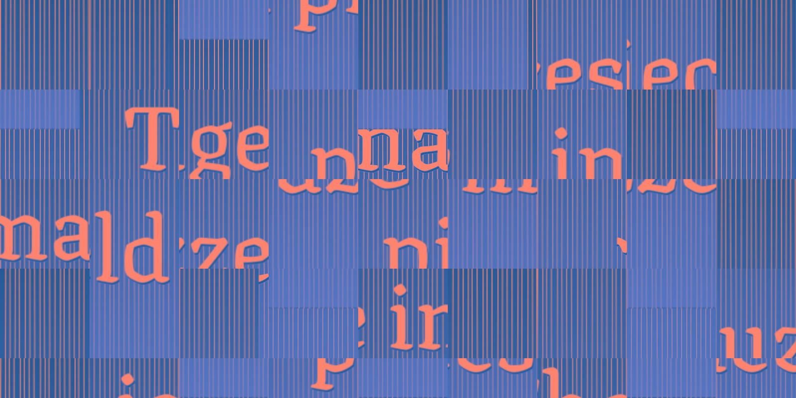

# p5-puzzle-effect

### Turn any of your static sketches ...


### Into a puzzeld-up sketch,


### with smaller or larger resolution.


## The images from above and this sketch are just an example, the effects function will work with any desgin as an input. 

### I import the font I'm using in ```style.css```
```css
@import url('https://fonts.googleapis.com/css2?family=Texturina:wght@900&display=swap');
```

### My basic ```sketch.js``` has no animation loop
```javascript
function setup() {
  createCanvas(800, 400);
  background(themeDark);
  
  // Just a few colors
  const themeDark = '#275B98';
  const themeLight = '#FF846F';
  const themeAccent = '#667FD1';

  // Irregular stripes in the bachkground
  stroke(themeLight);
  for (let x = 0; x < width; x += 5) {
    line(x + random(-1, 1), 0, x + random(-1, 1), height);
  }
  
  // A simple gradient
  for (let y = 0; y < height; y += 1) {
    const r = red(themeAccent);
    const g = green(themeAccent);
    const b = blue(themeAccent);
    const alpha = map(y, 0, height, 0, 190);
    stroke(r, g, b, alpha);
    line(0, y, width, y);
  }
  
  // Text layout
  const title = 'The image is puzzeld in pieces';
  textSize(90);
  textFont('Texturina');
  textAlign(CENTER, CENTER);
  
  fill(themeDark);
  text(title, 11, 22, width - 40, height - 40);
  
  fill(themeLight);
  text(title, 10, 20, width - 40, height - 40);
  
  // Done
  save('input-to-puzzle.jpg');
}
```

###  Then I include eeffects my script in ```index.html```
```html
  <script src="effects.js" defer></script>
  <script src="sketch.js" defer></script>
```

### Download or copy ```effects.js```
```javascript
function puzzle(buffer, scl) {
  // Set a new graphics buffer with the same dimensions
  const gfx = createGraphics(buffer.width, buffer.height);
  
  // Copy buffer to a p5.Image, it might be a a p5.Graphic  
  const bufferPixels = buffer.get();
  
  // All the pieces of the puzzle, each one is an image
  const pieces = [];
  
  // Used to remove selected indices, when piecing the puzzle
  const indices = [];
  let index = 0;
  
  // Split up the input image in a grid of smaller pieces
  for (let x = 0; x < buffer.width; x += scl) {
    for (let y = 0; y < buffer.height; y += scl) {
      // Slice up the image using
      pieces.push(bufferPixels.get(x, y, scl, scl));
      // Mark the index
      indices.push(index);
      index += 1;
    }
  }
  
  // Same loop as above, but this time we puzzle the images
  for (let x = 0; x < buffer.width; x += scl) {
    for (let y = 0; y < buffer.height; y += scl) {
      // Each cell: try a random index
      let index = floor(random(pieces.length));
      // Render the image in the buffer at current position
      gfx.image(pieces[index], x, y);
      // Remove index from the options to choose from
      pieces.splice(index, 1);
    }
  }
  
  // I assume we are done
  return gfx;
}
```

### Use it in your own ```sketch.js```
```javascript
function setup() {
  createCanvas(800, 400);
  
  // Anything can be drawn here ...
  
  const design = get();
  const resolution = 200; 
  image(puzzle(design, resolution), 0, 0);
}
```
