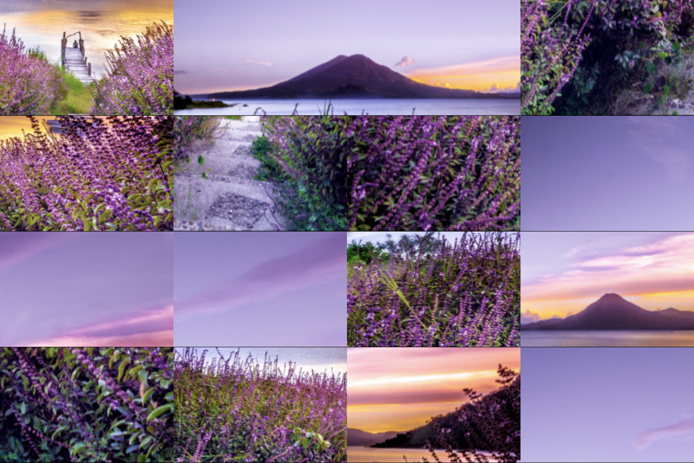
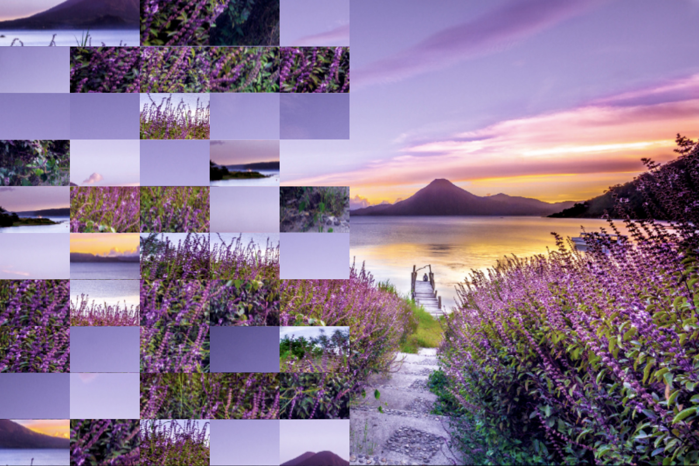
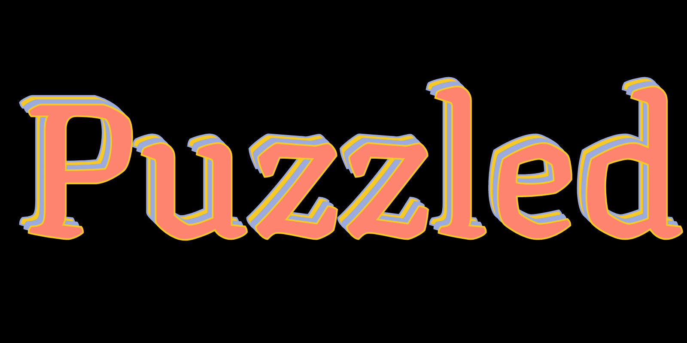
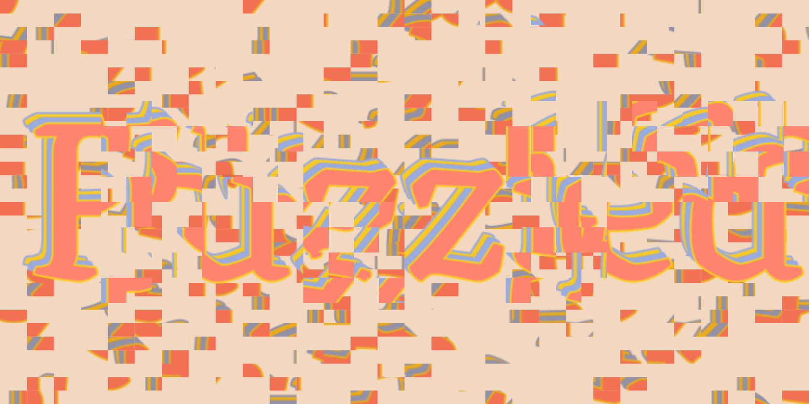
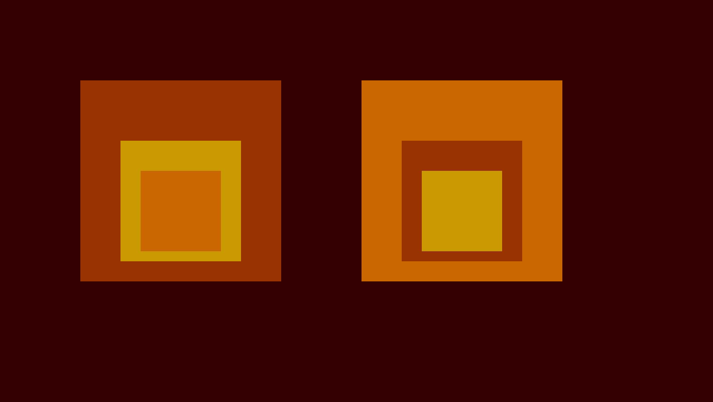
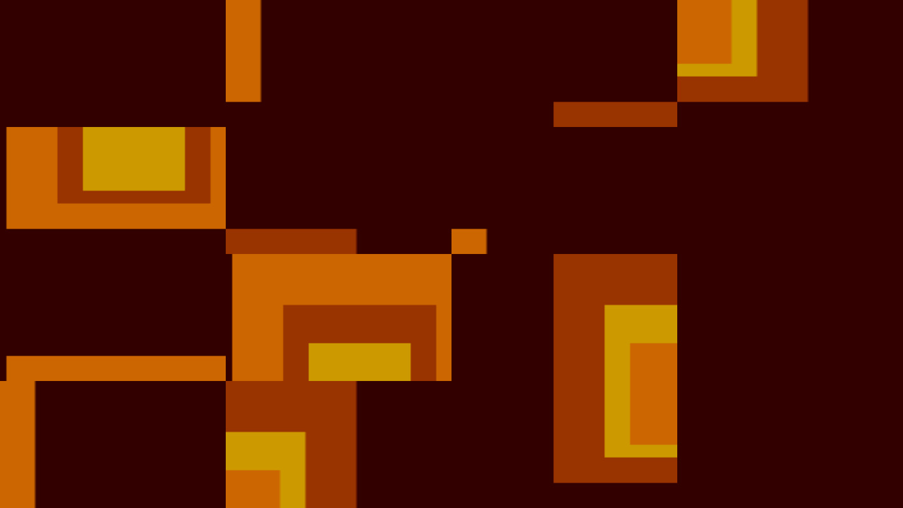

# p5-puzzle-effect

The ```puzzle(buffer, res)``` function splits up a given image, texture or graphics buffer into a grid of smaller images and returns with a new, randomly arranged composition of those pieces. Download the ```p5-puzzle-effect.js``` file and add it to your sketch. This is a visual experiment and research documentation for creative coders working with [Processing and p5.js](https://p5.org)

#### Input

#### Output


#### ```index.html```
```html
<script src="p5-puzzle-effect.js" defer></script>
<script src="sketch.js" defer></script>
```
#### ```sketch.js```
```javascript
let img;

function preload() {
  // https://unsplash.com/photos/K2s_YE031CA
  img = loadImage('mark-harpur.png');
}

function setup() {
  createCanvas(img.width, img.height);
  image(puzzle(img, 8), 0, 0);
  save('puzzeld-landscape.jpg');
}
```

#### ``````p5-puzzle-effect.js``````

```javascript
/**
 * Returns a puzzled version of the given image
 * - commented version
 * @requires {p5} Global mode
 * @param {p5.Graphics} buffer The given image to be puzzled
 * @param {number} res The resolution of the puzzle grid
 * @return {p5.Graphics} gfx A new buffer with the finished puzzle
 */
function puzzle(buffer, res) {
  // The graphic to be returned has the same size as the buffer we get
  const gfx = createGraphics(buffer.width, buffer.height);

  // To prevent us from errors wee make a deep copy of the given buffer
  const bufferPixels = buffer.get();

  // Define the size of a cell in the grid
  const sclX = buffer.width / res;
  const sclY = buffer.height / res;

  // Lists to be sorted and operated on
  const pieces = [];
  const indices = [];
  const newIndices = [];

  // Counter init
  let index = 0;

  // Populate data lists
  for (let x = 0; x < buffer.width; x += sclX) {
    for (let y = 0; y < buffer.height; y += sclY) {
      // Images go in the pieces list
      pieces.push(bufferPixels.get(x, y, sclX, sclY));

      // Saving the index positions seperatly
      indices.push(index);
      index += 1;
    }
  }

  // Puzzeling a new list
  while (newIndices.length <= pieces.length) {
    // Pick a random index from the options indices.length will shrink...
    const index = floor(random(indices.length));

    // Add to new list
    newIndices.push(indices[index]);

    // Remove from options to pick
    indices.splice(index, 1);
  }

  // Reset counter
  index = 0;

  // Redraw the final image into the graphic
  for (let x = 0; x < buffer.width; x += sclX) {
    for (let y = 0; y < buffer.height; y += sclY) {
      // Get the sorted indices and
      gfx.image(pieces[newIndices[index]], x, y);
      index += 1;
    }
  }

  // Done return the final graphic
  return gfx;
}
```
# How to use this function?

## Basic Example ***The split screen idea***

```javascript
let img;

function preload() {
  img = loadImage('mark-harpur.png');
}

function setup() {
  createCanvas(img.width, img.height);
  const halfImage = img.get(0, 0, img.width * 0.5, img.height);
  image(img, 0, 0);
  image(puzzle(halfImage, 10), 0, 0);
}
```
## Puzzle ***your own graphics*** instead of an image



```css
/* Import custom font */
@import url('https://fonts.googleapis.com/css2?family=Texturina:wght@900&display=swap');
```
```javascript
function setup() {
  // Basic typographic design
  createCanvas(800, 400);
  textFont('Texturina');
  textSize(220);
  textAlign(CENTER, CENTER);
  strokeWeight(4);
  const x = width * 0.5;
  const y = height * 0.5;

  // Overlay three colorful text boxes
  stroke('#9BABDD');
  fill('#F7C925');
  text('Puzzled', x, y);
  fill('#9BABDD');
  text('Puzzled', x + 5, y + 5);
  stroke('#F7C925');
  fill('#FF846F');
  text('Puzzled', x + 10, y + 10);

  // Store the current buffer and clear
  const design = get();
  clear();

  // Warm background color
  background('#F2D8C0');

  // Full puzzled background
  image(puzzle(design, 30), 0, 0);

  // Construct a grid with the current buffer
  const scl = 100;
  for (let x = 0; x < width; x += scl) {
    for (let y = 0; y < height; y += scl) {
      // Randomly apply puzzle
      if (random(0, 1) > 0.5) {
        image(design.get(x, y, scl, scl), x, y);
      } else {
        image(puzzle(design.get(x, y, scl, scl), 4), x, y);
      }
    }
  }
}
```

### Puzzle ***any static sketch***?
#### https://p5js.org/examples/color-color-variables.html



```javascript
function setup() {
  createCanvas(710, 400);
  noStroke();
  background(51, 0, 0);

  let inside = color(204, 102, 0);
  let middle = color(204, 153, 0);
  let outside = color(153, 51, 0);

  push();
  translate(80, 80);
  fill(outside);
  rect(0, 0, 200, 200);
  fill(middle);
  rect(40, 60, 120, 120);
  fill(inside);
  rect(60, 90, 80, 80);
  pop();

  push();
  translate(360, 80);
  fill(inside);
  rect(0, 0, 200, 200);
  fill(outside);
  rect(40, 60, 120, 120);
  fill(middle);
  rect(60, 90, 80, 80);
  pop();

  // Added code
  const design = get();
  clear();
  image(puzzle(design, 4), 0, 0);
}
```